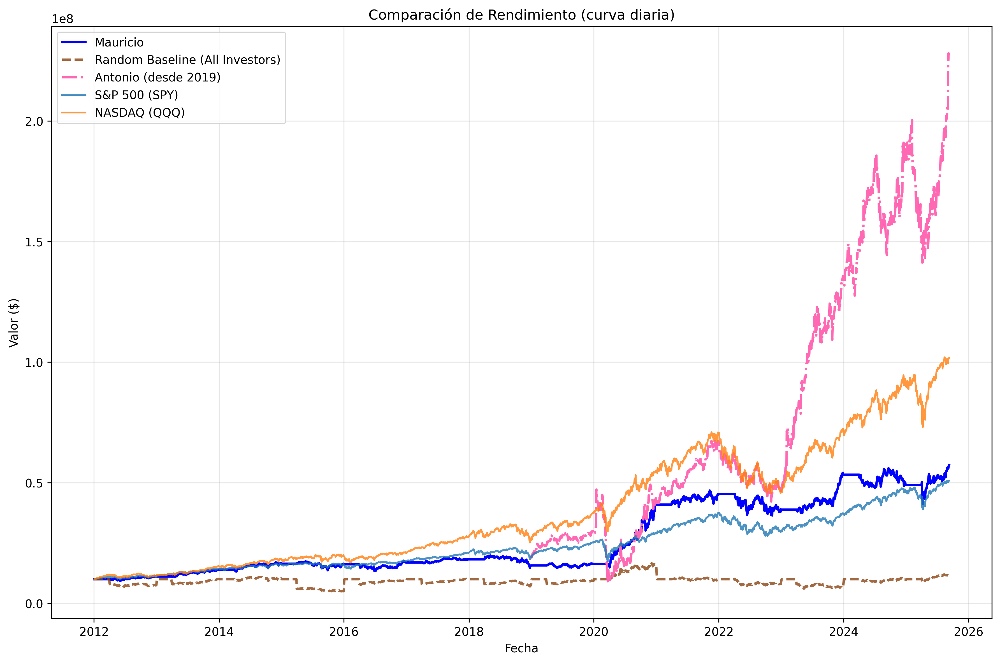

# Investment Backtest Analyzer - Website

This is a free static website for your Investment Backtest Analyzer application.

## 🌐 Free Hosting Options

### Option 1: GitHub Pages (Recommended - Completely Free)

1. **Create a GitHub account** (if you don't have one): https://github.com
2. **Create a new repository**:
   - Go to GitHub and click "New repository"
   - Name it something like `investment-backtest-website`
   - Make it public (required for free GitHub Pages)
   - Initialize with README

3. **Upload your website files**:
   - Upload the `index.html` file to your repository
   - You can also upload any images like `performance_comparison.png` if you want to display them

4. **Enable GitHub Pages**:
   - Go to repository Settings
   - Scroll down to "Pages" section
   - Under "Source", select "Deploy from a branch"
   - Choose "main" branch and "/ (root)" folder
   - Click Save

5. **Your website will be live at**: `https://yourusername.github.io/repository-name`

### Option 2: Netlify (Also Free)

1. Go to https://netlify.com
2. Sign up with GitHub account
3. Drag and drop your `index.html` file to deploy
4. Get a free subdomain like `yourapp.netlify.app`

### Option 3: Vercel (Free)

1. Go to https://vercel.com
2. Sign up with GitHub account
3. Import your repository or upload files
4. Get a free subdomain like `yourapp.vercel.app`

## 📁 File Structure

```
your-website/
├── index.html          # Main website file
├── README.md          # This file
└── assets/            # (optional) for images
    └── performance_comparison.png
```

## 🎨 Customization

You can easily customize the website by editing the `index.html` file:

- **Colors**: Change the CSS color variables
- **Content**: Update the text to match your specific tool features
- **Links**: Add real GitHub repository links
- **Images**: Replace the chart placeholder with your actual performance charts
- **Statistics**: Update the numbers to reflect your actual backtest results

## 📊 Adding Real Charts

To display your actual performance charts:

1. Copy your `performance_comparison.png` to the website folder
2. Replace the chart placeholder in `index.html` with:
   ```html
   
   ```

## 🔗 Connecting to Your GitHub Repository

Once you have your code on GitHub:

1. Update the GitHub button link in `index.html`
2. Replace `#` with your actual repository URL
3. Consider adding a direct download link to a ZIP file of your code

## 💡 Next Steps

1. **Deploy the website** using one of the free options above
2. **Share the link** with potential users
3. **Add analytics** (Google Analytics is free) to track visitors
4. **Create a blog section** to share investment insights
5. **Add a contact form** using services like Formspree (free tier available)

## 📱 Mobile Responsive

The website is fully responsive and will look great on:
- Desktop computers
- Tablets
- Mobile phones

## 🚀 Going Further

Consider adding:
- **Documentation pages** explaining how to use your tool
- **Tutorial videos** or screenshots
- **Case studies** showing real backtesting examples
- **FAQ section** for common questions
- **Newsletter signup** to build an audience

## 💰 Costs

All the suggested hosting platforms have generous free tiers:
- **GitHub Pages**: Completely free for public repositories
- **Netlify**: 100GB bandwidth/month free
- **Vercel**: 100GB bandwidth/month free

You won't need to pay anything unless you get significant traffic (which would be a good problem to have!)
